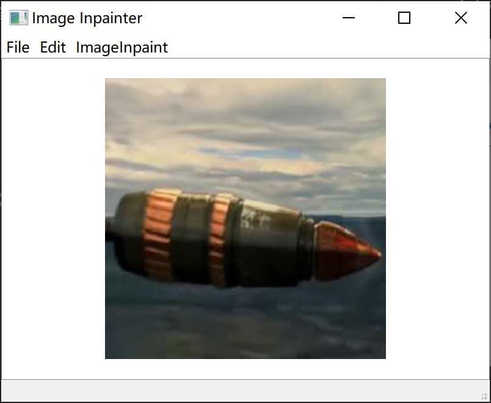
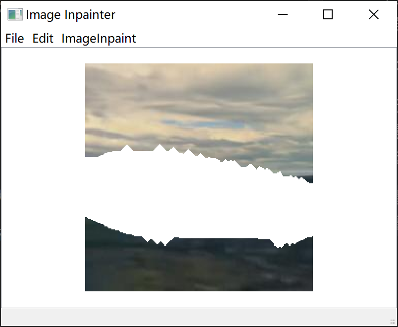
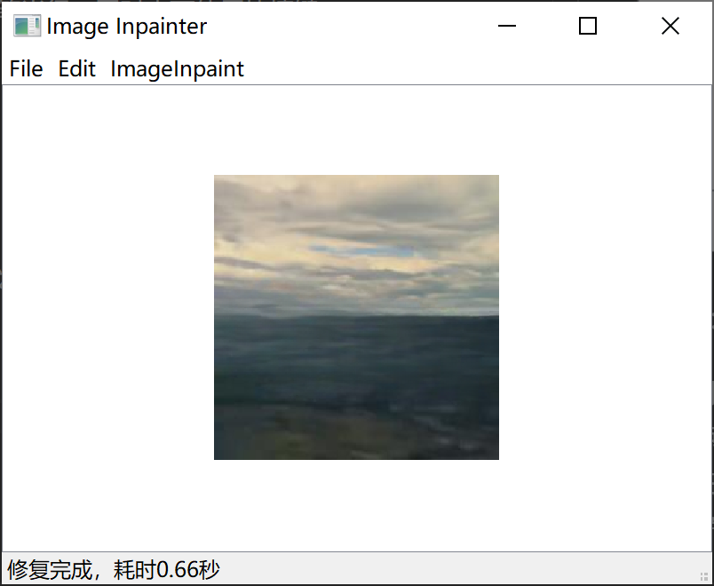

# 图像修复模块

基于[LaMa图像填充 · 模型库 (modelscope.cn)](https://www.modelscope.cn/models/iic/cv_fft_inpainting_lama/summary)实现。

## 环境配置

#### 选择1：建立新的运行环境：

这样会直接新建一个image_inpaint的环境：

```
conda env create -f environment.yml
```

#### 选择2：在已有环境内安装需要的库：

需要：opencv-python，pyqt5和modelscope三个库，前两个很好安装，[modelscope](https://www.modelscope.cn/docs/%E7%8E%AF%E5%A2%83%E5%AE%89%E8%A3%85#:~:text=%E6%9D%A1%E4%BB%B6%E8%87%AA%E8%A1%8C%E9%80%89%E6%8B%A9%E3%80%82-,ModelScope%20Library%20%E5%AE%89%E8%A3%85,-%23)略微麻烦：

1. 先安装好torch和torchvision，安装方式多种多样，也可能已有环境已经准备好了。
2. 安装tensorflow的cpu版本：

```
pip install --upgrade tensorflow==2.13.0
```

3. 安装modelscope核心库和其cv组件：

```
pip install modelscope
pip install "modelscope[cv]" -f https://modelscope.oss-cn-beijing.aliyuncs.com/releases/repo.html
```

## 运行说明

Main.py为程序入口，开始运行后，进入主窗口，其基本功能为图像查看器

[](./attachments/image.png =400x300)

功能1：绘制和保存Mask

1. 打开文件，选择图像，会显示在主窗口内
2. 使用鼠标长按在图像上涂抹Mask，通过Edit下的选项增加或减少画笔半径，同时也可使用快捷键
3. 绘制完成后，点击文件中的保存Mask，选择保存路径进行保存



功能2：单张修复

1. 打开图像
2. 点击图像修复菜单下的inpaint选项，此时会弹出选择对应的Mask文件，必须为png结尾和图像相同的黑白文件，白色代表待修复区域
3. 确定mask后会立刻开始修复，修复完成会在显示窗口加载修复结果，并在状态栏输出修复耗时



功能3：批量修复

1. 无需打开图像，直接点击修复菜单下的batch inpaint选项
2. 需要依次选择待修复图像文件夹，Mask文件夹和保存路径
3. 选择完成后会进行合法性检查，检查通过开始修复，修复完成会在状态栏输出总耗时和平均耗时

> 待修复图像文件夹下存放所有待修复的图像文件，会忽略文件夹的存在，Mask文件夹下存放所有待修复图像文件的**同名Mask**，后缀为png。